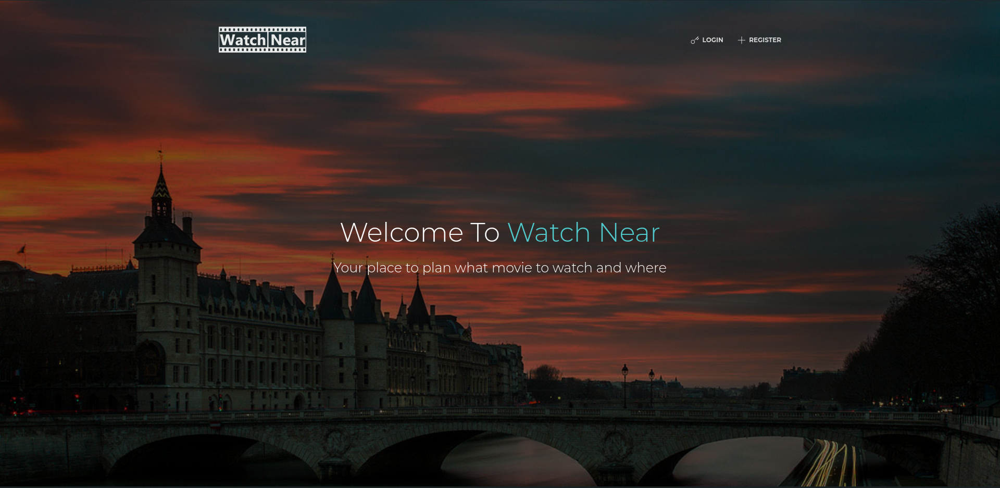
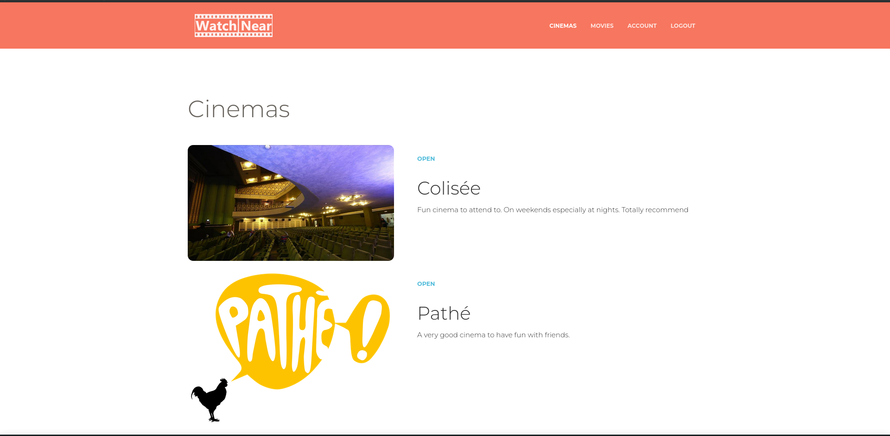
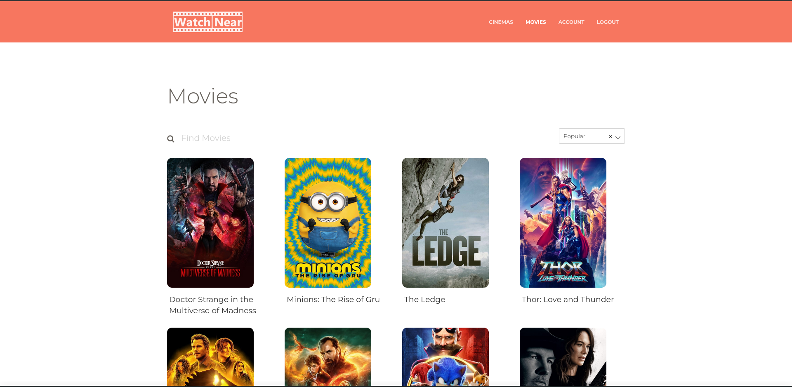
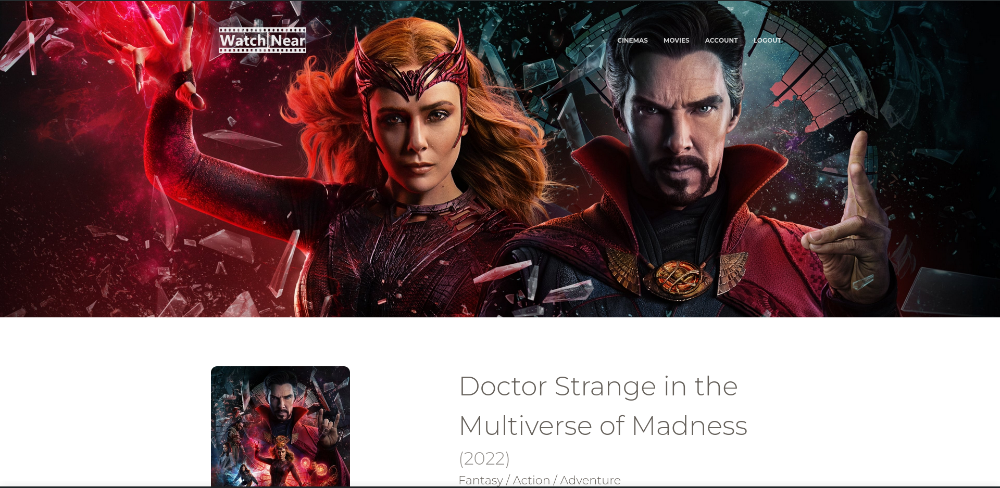
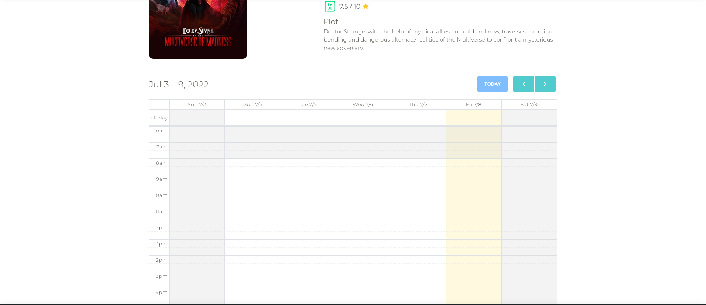

# Watch Near Frontend

## Overview 

This is the frontend for watch near. A plateform that centralizes cinema plannings on one website!

For the backend please check [Watch Near Backend](https://github.com/Saief1999/web-project-gl4-back)









## Technical Details

<div style="align-items:center">
  
  
</div>

The frontend is developed using **Angular** and **Bootstrap**. 

SonarQube is being used ( Within a github action ) to ensure code quality with each commit.

## Running the application 

To run the development server

```bash
ng serve
```